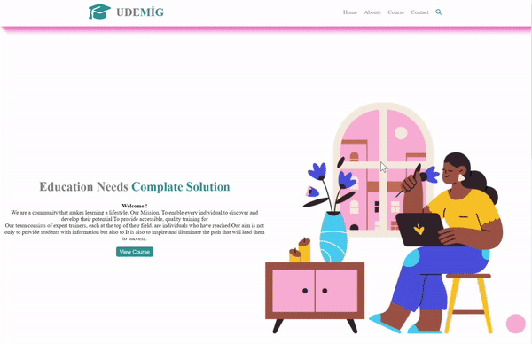

 <h1> Udemig Course </h1>

Bu proje, modern web teknolojileri kullanılarak geliştirilmiş bir eğitim portalını içerir. HTML ve CSS ile oluşturulmuş olan bu portal, kullanıcılara çeşitli eğitimlere erişim imkanı sunar.

<h2>Proje İçeriği </h2>

<ul>
<li>Home</li>
<li>About</li>
<li>Contact</li>
<li>Course</li> 
</ul>

<h2>Home</h2>
Burada popüler kurslar, öne çıkan eğitmenler ve yeni eklenen içeriklere erişim sağlanır.

<h2>About</h2>
Projenin arkasındaki ekip ve misyon hakkında bilgiler içerir. Ekip üyelerinin tanıtımları ve projenin amaçları bu bölümde bulunur.

<h2>Course</h2>
Farklı kategorilere ayrılmış olarak sunulan eğitim kurslarına erişim sağlanır. Kullanıcılar ilgi duydukları alanlarda kurs arayabilirler.

<h2>Contact</h2>
 Kullanıcıların proje ekibi ile iletişime geçebilmek için kullanabileceği iletişim bilgileri ve iletişim formu bu bölümde bulunur.

 <h3>Kullanilan Teknolojiler</h3>
<ul>
<li>HTML</li>
<li>CSS</li>
</ul>

<h2>Ekran Goruntusu</h2>

 

